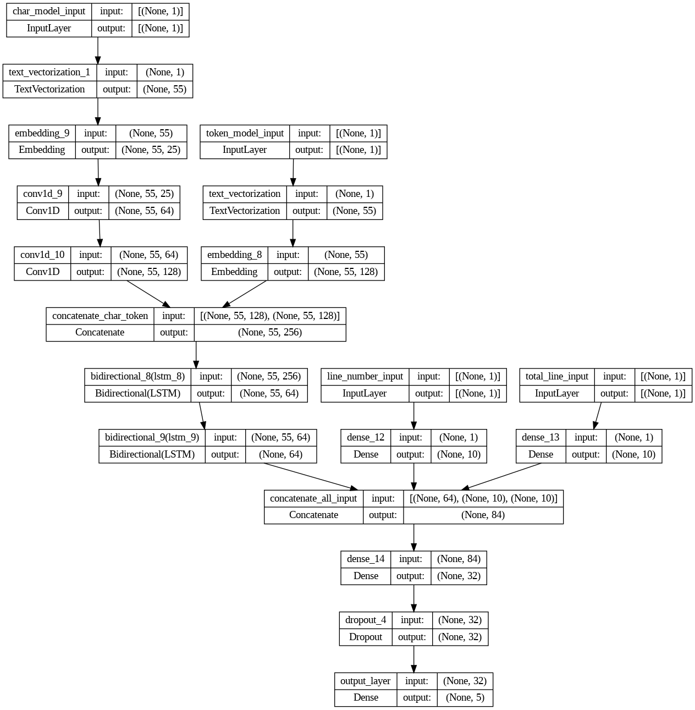
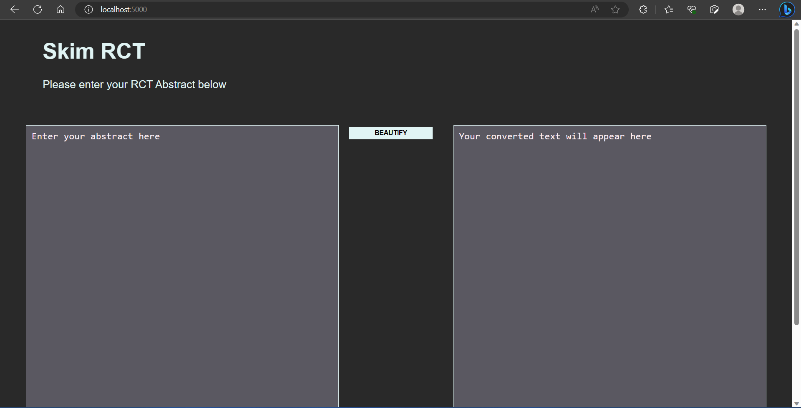
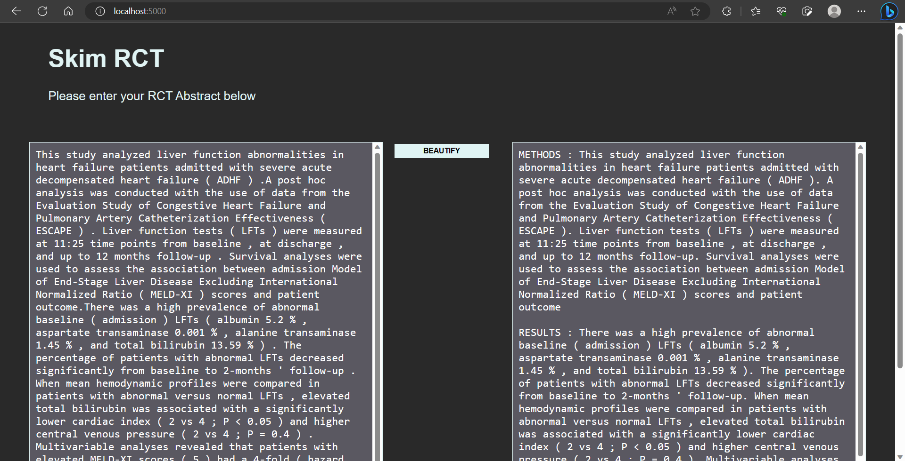

# skim-RCT

Taking reference from the paper [PubMed 200k RCT: a Dataset for Sequential Sentence Classification in Medical Abstracts](https://arxiv.org/abs/1710.06071) which presented dataset PubMed 200k RCT consisting of ~200,000 labelled data for Randomized Controlled Trial (RCT) abstracts from different medical papers. Using similar model architecture from the paper [Neural Networks for Joint Sentence Classification in Medical Paper Abstracts](https://arxiv.org/abs/1612.05251). Making use of PubMed 20k RCT dataset to train the model and able to achieve ~88% accuracy on unseen test data. The dataset can be found at [pubmed-rct](https://github.com/Franck-Dernoncourt/pubmed-rct)

The flask application takes as the input RCT abstract text and uses the model to predict one of the 5 categories {"Background", "Methods", "Objective", "Results", "Conclusions"} for each sentence in the abstract, it is then presented in neat, easy to read format.

## Setup:
Create new environment for the application using Anaconda at the root project folder and install the required packages for python

```
$ conda create -p venv python==3.7 -y
$ conda activate ./venv
$ pip install -r requirements.txt
```

## Run app:
Use the following command to run the Flask server on localhost

```
python ./src/app.py
```

### Website
Open the following URL in the browser of your choice

```
http://localhost:{port}/
```

### Model architecture
Using character embeddings, word embeddings and line number the text appears on relative to the entire abstract as 4 inputs to the model.


## Screenshot
### Home page:
Flask application opened in browser where we can insert RCT abstract.


### Categorized result:
Insert abstract on the left hand side text area and click on "Beautify" button to get categorized easy to read text on the right hand side.


## Experimental Colab notebook
The experimental colab notebook is present at 
`./src/experiment/SkimRCT.ipynb`.

## Future work
The model is trained on PubMed 20k, more data can be used to better train the model with PubMed 200k. The data collection from different papers other than just RCTs can also help expand the scope and generalize the model. 

The flask app can be hosted on any cloud platform or can be containerized. Can deploy the app as backend and use a separate Angular or React frontend for better user experience.